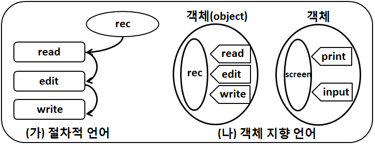

Python SIG 5주차
===

## Function(Continued) & OOP

---

OOP란?
===

Object Oriented Programming의 약자로
지금까지 배워온 절차지향적 프로그래밍과 달리
**객체**라는 개념을 이용한 프로그래밍

---

절차지향 vs OOP
===



---

그래서 뭐죠???
===

단순하게 말하자면 어떤 데이터를 처리할 **틀**을 만들고
그 틀을 계속해서 우려먹고 싶다!!!

---

예시1
===

```Python3
a = -2
print(type(a))
print(a.__abs__())
print(a.__add__(4))
print(a.__mul__(3))
```

---

예시2
===

```Python3
b = 'SCSC'
print(type(b))
print(b.__contains__('CSC'))
print(b.__len__())
```

---

예시3
===
함수 `help`를 이용해서 직접 확인해봅시다
```Python3
help(dict)
help(tuple)
```

---

이상에서 확인할 수 있는 점
===
### 1. 뭔지는 잘 몰라도 `.`을 이용하여 무엇을 한다
### 2. `help`로 뜯어보니까 `class <name>:` 꼴로 시작한다
### 3. `help`로 뜯어보니까 `Methods`라는게 있다
### 4. 근데 `Methods`에 `self`라는 단어가 빈번히 등장한다

---

이제 직접 만들어 봅시다
===
```Python3
class SCSC_admin:
    def __init__(self, name, age):
        self.name = name
        self.age = age
    def is_DSbro(self):
        if self.name == 'DSbro':
            print('Yes he is!')
        else:
            print('Nope ㅠㅠ')

SWKim = SCSC_admin('SeongWoo Kim', 21)
DSbro = SCSC_admin('DSbro', 22)

SWKim.is_DSbro()
SCSC_admin.is_DSbro(DSbro)

print(SWKim.name)
```

---

설명충 깜짝 등장!
===
`class SCSC_admin:` 부분은 `SCSC_admin`이라는 이름의
`class`를 만드는 부분. 함수를 선언할 때와 비슷하다.

`def __init__(self, name, age):`부분은 `class`의 구체화, 
`instance`를 만드는 생성자. 자세한 내용은 나중에...

`def is_DSbro(self):` 부분은 `is_DSbro`이라는 이름의 클래스에 
달린 함수를 만드는 부분. 이 함수는 `.`을 이용해서 `class`에서 직접쓰거나 `instance`에서 쓸 수 있음.

---

설명충 깜짝 등장!
===
`SWKim = ...`, `DSbro = ...` 부분은 `instance`를 만드는 부분
`def __init__(self, name, age):`부분이 있어야 작동함

`SWKim.is_DSbro()`, `SCSC_admin.is_DSbro(DSbro)` 부분은 
함수 `def is_DSbro(self):`을 실행하는 부분

`print(SWKim.name)`부분은 `instance` `SWKim`의 `attribute` `name`을 출력하는 부분

---

핵심 정리
===
* `class`는 함수와 비슷하게 정의할 수 있다
* `class`의 하나의 사례, 구체화를 `instance`라고 부른다
(`class`라는 맥락 없이 부를 때는 `object`라고 부른다)
* `class`에 딸린 함수, 변수들은 각각 `method`, `attribute`라고 부른다
*  그리고 `.`을 이용해서 접근한다
(e.g. `DSbro.name`)

---

`__init__`함수는 그래서 무엇?
===
`class`를 만들 때, 그 `class`가 담고 싶은 데이터 종류가 있을 것이다. (e.g. `name`, `age`, `heigt` , ...)
그러한 것들을 매번 일일히 입력하면 무척 번거로울 것이다
> If not `__INIT__`
```Python3
SWKim = SCSC_admin()
SWKim.name = 'SeongWoo Kim'
SWKim.age = 21
```

---

`__init__`함수는 그래서 무엇?
===
`__init__`함수는 이러한 불편함을 없애기 위해 `instance`를 만들 때, 자동적으로 호출되어 그 `instance`를 초기화 시켜준다.
```Python3
SWKim = SCSC_admin('SeongWoo Kim', 21)
```
>`SWKim`이란 `SCSC`의 `instance`를 만들고
>`SWKim.name` <- `'SeongWoo Kim'`
>`SWKim.age` <- `'21'`

---

`self`는 또 뭔가요?
===
`instance`내에서 함수를 호출하면, 첫 번째 인자는 **무.족.권** 자기자신이 들어간다. 이를 표현하기 위해 통상적으로 `self`라고 표시하는 것. 따라서 그 변수 이름은 다른 이름을 사용해도 상관은 없다. 근데 그러지 말자
(참고로 `class`내에서 실행하면 그렇지 않다) 

---

`self`예시1
===
```Python3
class Human:
    def __init__(self, name):
        self.name = name
    def my_name(self):
        print('My name is {}'.format(self.name))

Lie_kun = Human('Lie Young Jae')
Lie_kun.my_name()

Human.my_name(Lie_kun)
```
이제 위 예시에서 `self` 자리를 전부 `anyword`로 바꾸고 실행해 보라!

---

`self` 예시2
===
```Python3
class Foo:
    def bar1():
        print('Hello! I'm class')
    def bar2(self):
        print('Hello! I'm instance')
        
a = Foo()
# a.bar1()
a.bar2()
Foo.bar1()
# Foo.bar2()
```